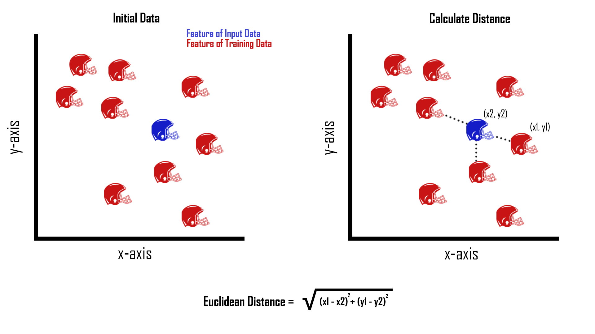
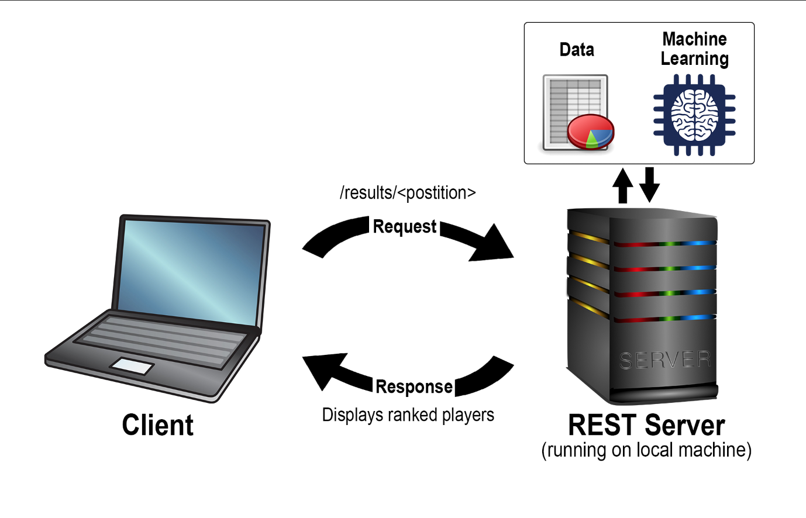

# Rookie Fantasy Football Point Prediction

| Andrew Gotts, Ethan Japundza, Brian Schwantes  
| adgotts@iu.edu, ejapundz@iu.edu, bschwant@iu.edu  
| Indiana University
| hid: sp19-222-94, sp19-222-90, sp19-222-92  
| github: [:cloud:](https://github.com/cloudmesh-community/sp19-222-90/blob/master/project-report/report.md)
| code: [:cloud:](https://github.com/cloudmesh-community/sp19-222-90/tree/master/project-code)

---

Keywords: KNN, Fantasy Football, REST, Docker, Yaml

---

## Abstract

As the number of fantasy football players increases dramatically every year, we saw an opportunity to create a service that will help users draft better teams. While NFL veterans have gameplay for fantasy enthusiasts to evaluate, incoming rookies with a lack of professional experience make it difficult for fans to evaluate whether or not their teams picks will be successful in the NFL. To solve this problem, we implemented a REST service that gets an aggregate of combine and fantasy football data from Google-Drive. Our service then utilizes the K-Nearest Neighbor machine learning algorithm on our data sets, outputting our projections for which 2019 NFL Rookies will score the most fantasy football points based on their metrics from the combine.

## Introduction

Who should be the top pick in this years fantasy football draft? This is a question that has plagued fantasy football enthusiasts since its creation in 1962. But why does it even matter, isn't fantasy football just a game? According to Joris Drayer, a professor at Temple University in Sports Marketing and Analytics, almost 30 million Americans and Canadians actively participate in fantasy sports leagues every year. Drayer goes on to discuss the economic impact that fantasy football has on the sports industry, estimating it to be nearly $4.5 billion [@Drayer2010ff]. With such a large amount of people and money involved, the technologies created to help players be successful are in a position to revolutionize the fantasy football market. Utilizing the power of machine learning, we were able to create the 'Rookie Fantasy Football Point Predictor'. A service for those trying to make an educated pick on rookie players with no professional experience.

## Data Set 

Our project uses information from three data sets consisting of the 2000-2018_NFL_ Combine statistics, the 2019_NFL_Combine statistics for this year's rookies, and the 2001-2018_Fantasy_Football data for every active NFL player. These datasets include six combine drills:

* 40-Yard Dash: Measures a player's explosion, burst, and acceleration.
* Three-Cone Drill: Highlights a players ability to shift directions at a high speed.
* Shuttle Run: Demonstrates short area lateral quickness, and the speed at which a player can change directions. 
* Vertical Jump: Tests for lower body extension and power.
* Broad Jump: Evaluates an athlete's lower-body explosion, and lower-body strength.
* Bench Press: Demonstrates a players strength and endurance.

From these drills measurables are obtained that can serve as a predictor for the rookies effectiveness in the NFL. For certain positions, like wide receiver, the shuttle run is significant as this drill will often determine whether or not the defender is able to get separation between his defender at the line of scrimmage.  While for other positions like quarterback, the shuttle run has less importance as they are rarely making quick and decisive cuts while playing in NFL games [@Brad2018Combine]. Due to the difference in how each drill can serve as a predictor for different positions, we found the best way to analyze the incoming rookies within the 2019_NFL_Combine dataset was to compare their performance to previous NFL players within the 2000-2018_NFL_Combine dataset.  From this comparison, our goal was to both rank and predict the average fantasy points-per-game for the incoming rookie class based on how their comparisons performed in the 2001-2018_Fantasy_Football dataset. We found the best way to make  this correlation was to employ the K-Nearest Neighbor machine learning algorithm for our service.

## KNN Algorithm

The machine learning technique KNN (K-Nearest Neighbors) is a technique often used for classification or linear regression predictive problems. The algorithm relies on feature similarity, or the process of checking how an input sample will resemble the training set [@Tavish2018KNN]. Using the Euclidean distance formula, KNN calculates which features of the input sample are nearest to the training set. @fig:knn is a graphical illustration of this process.

{#fig:knn}

The Euclidean distance formula, @eq:euc-dist, is used within KNN to calculate the distance between a feature of the input data, blue helmet, and k instances of that same feature within the training data, red helmets. Choosing the value of k is dependent on the training datasets used and the desired outcome. Compared to other machine learning algorithms, KNN has an advantage as it does not make assumptions about the data it uses, it is simple, highly effective, and it is versatile. However to its disadvantage, the KNN algorithm requires that we store all of the training dataset, which will often cause the algorithm to be computationally expensive and slow [@Tavish2018KNN].


$$Euclidean Distance = \sqrt{\left ( x_{1}- x_{2} \right) ^{2}+ \left ( y_{1}-y_{2} \right) ^2}$${#eq:euc-dist}

Before our implementation of the KNN algorithm, we found that choosing a value of three to represent our k would best optimize the results of the program. In the python file k-nearest, we call and train the KNN algorithm with the NFL combine results from the last 18 years. Using the incoming rookies 2019_NFL_Combine statistics as the input data, the program calculates the Euclidean distance between each feature of the input data and the accumulated combine results of previous years. This calculation yields the three closest veteran players that each NFL rookie performed the most similar to during the combine. While the results of our implementation are accurate and informative, the speed disadvantage of the KNN algorithm becomes apparent within our program. Despite making adjustments to speed up the algorithm, such as only running KNN on the instances of the input data called for opposed to running it on all of the input data and filtering it afterward to get a tailored output, the program still runs slowly. This is due to the KNN algorithm requiring us to store the entire dataset before it runs computations on it. Despite our best efforts of optimization, our program still has a run speed of about five seconds.

Another disadvantage of the KNN algorithm and other machine learning techniques is their tendency to un-intentionally weight certain features of datasets due to size and scale differences. To account for this, we have to normalize the datasets we pass into the algorithm, creating an equal ‘weight’ for the Euclidean distance to calculate. In Python using the PANDAS library, or Python Data Analysis Library, allows us to do just that, and easily import the csv’s needed to execute the KNN algorithm.

From this library we use the read.csv function to read the NFL csv, comma-separated value, files into a data frame. A data frame is a two-dimensional tabular data structure with labeled axes, in which arithmetic operations align on both row and column labels. We use this data frame to isolate only our numeric features within the dataset, allowing us to quickly use only the features from the NFL combine that are measurables. As discussed earlier, in order for our output to be accurate the numeric features within each dataset must be normalized to create an equal weight for each combine measurement. Using the PANDAS data frame we achieved this by taking the numeric features and subtracting them from their mean. Once this was done we divide them by the standard deviation of the dataset, resulting in a very neat and evenly weighted data frame to pass into the KNN module.


## Implementation

The core of this project is written in Python, which allows us to package all components needed to run our service easily. The use of "in_it" files creates a sensible directory structure that ensures a user can import both functions and data if they see them useful for personal applications. The versatility of python enabled us to create functions that execute the machine learning on our NFL datasets, along with a server that hosts these functions tied together through a REST service.

REST, or Representational State Transfer, is a style of architecture used when creating web services. From the textbook, REST is described as being "based on stateless, client-server, cacheable communications protocol.” Applications using this architecture typically use HTTP protocol with basic methods like GET, PUT, and POST. These methods allow applications using the REST architecture to perform the four CRUD operations, which are to create, read, update, and delete resources. User created functions can be combined with these operations to create a cloud service that completes predefined tasks between a server and a client. However, to establish this direct link between a server and a client a YAML file is required [@pautasso2009restful].

A YAML file is written in a readable data serialization language that can be used to configure endpoints for a server. These endpoints are used to dictate what URLs are valid within the server, and what data, or data types, will be displayed for a particular path. YAML also allows specifications to be added to endpoints such as operations, HTML responses, and HTTP methods. Future additions to endpoints are simple to add without affecting current endpoints, which makes future updates straight forward with few worries about breaking past versions. This provides flexibility that is complemented by an easy to read syntax.

Our project uses REST architecture, in conjunction with a YAML file, to package our python modules so that they are able to run on a local machine. Within the YAML file, there are predefined paths a user can enter for different purposes. For our project, the path can be altered by changing ‘/results/’ to view fantasy football point predictions based on a given position.


{#fig:REST}

Visualized in @fig:REST, when an offensive position is entered, the HTTP request is then sent to the REST server. From here, our service calls the python function ff_prediction(position) within the nfl-analysis.py file. First datasets are retrieved from a Google drive. Next, the machine learning is executed and the players are ranked through our comparative analysis and exported to a csv file. We then convert the final csv file to a html table, where it is printed to the users screen at the endpoint defined in the yaml file. While this is functional, we aren’t able to ensure consistency across multiple development and release cycles, which highlights the advantage of using a software like Docker to standardize the environment of our project.

Docker is a tool that allows users to create, deploy and run applications within virtual containers. This technology is extremely useful when developing applications because it allows one to combine all of the needed components into one package [@Novoseltseva2017docker]. Docker also ensures parity, which allows your images to run the same regardless of the server or laptop it is running on. This eliminates bugs that will occur on only certain computers, creating a standardized environment. We utilized Docker within our project by implementing compatibility through the use of a Dockerfile and a Makefile which makes it easy for users to build the Docker container, run the server within the Docker container, and remove the Docker images. The inclusion of the Makefile simplifies the process for users looking to run our service and remove it once they are finished with it, ensuring no compatibility issues. The user only needs the Dockerfile and the Makefile to use our service to its fullest extent.


## Limitations

As mentioned before, the NFL combine has six tests that measure speed, agility, and strength. We used that data in conjunction with each players height and weight when finding their "nearest neighbors." However, not all players, rookies and current, completed every drill at the combine. This can result in inaccurate rankings, as KNN is only finding comparisons within one drill. Unfortunately, this gave players who skipped drills a boost in our rankings, as they tended to dominate in the the drills they did choose to participate in. Another hindrance is that we had no way of knowing what NFL team each rookie will be drafted to, and whether or not they will be becoming a starter or second string player. The role the rookie has within his team is a huge factor in Fantasy Football, and not being able to take this into account creates a limitation on how accurate our model can be. Going forward, one way we could attempt to increase the accuracy of our predictions is to compensate for both of these factors, and to utilize rookies college football statistics. While using college statistics was in our initial plans, we ultimately decided that the differences in conference and division could provide skewed data resulting in inaccurate predictions. This would not be impossible to account for, but it was not realistic to achieve this in the timeframe we were given. 

## Conclusion

As the number of Fantasy Football players continues to increase, we set out to answer the age old question, who should be my top pick in this years fantasy football draft? To help our fellow fantasy football players answer this question, we provide users of our service with a way to make educated draft picks on rookies that are likely to succeed in the NFL. To accomplish this goal, we used nearly 20 years worth of NFL combine and fantasy football data to create a service using REST, Python, Yaml, and Docker. Utilizing these technologies along with artificial intelligence, we were able to successfully rank rookies by their position, accompanied by our prediction of average fantasy points per game. 

We hope to test the accuracy of our service throughout the course of 2019 to see if this years rookies will hold up to our predictions. If we were to address some of our limitations, adding factors such as the role a rookie will play on his team, we would be able to continuously update our service and make adjustments. Analyzing these results would help us make it more accurate for next year's draft, and if we find our algorithm to be successful we have an avenue for deploying it into the real world. Providing users with educated sports picks through machine learning could revolutionize fantasy sports; and in a market that has nearly a $4.5 billion impact across the sports industry, this information has the opportunity to produce serious revenue. We hope to continue building on top of this foundation, and refine our model with hopes of eventually tapping into this market. 


## Specification

```
swagger: "2.0"
info: 
  version: "0.0.1"
  title: "NFL FF Points"
  description: "A service that provides Fantasy Football point predictions for upcoming NFL rookies"
  termsOfService: "http://swagger.io/terms/"
  contact: 
    name: "NFL FF Prediction Service"
  license: 
    name: "Apache"
host: "localhost:8080"
basePath: "/cloudmesh/nfl-analysis/v1"
paths: 
  /results/{position}:
    get:
      tags:
        - NFL
      parameters:
        - name: position
          in: path
          description: position
          type: string
          required: true
      operationId: nfl-analysis.ff_prediction
      produces:
        - text/html
      responses: 
        "200":
          description: "FF data"
          schema:
            $ref: "#/definitions/NFL"
definitions:
  NFL:
    type: "string"
    properties: 
      model:
        type: "string"
```
